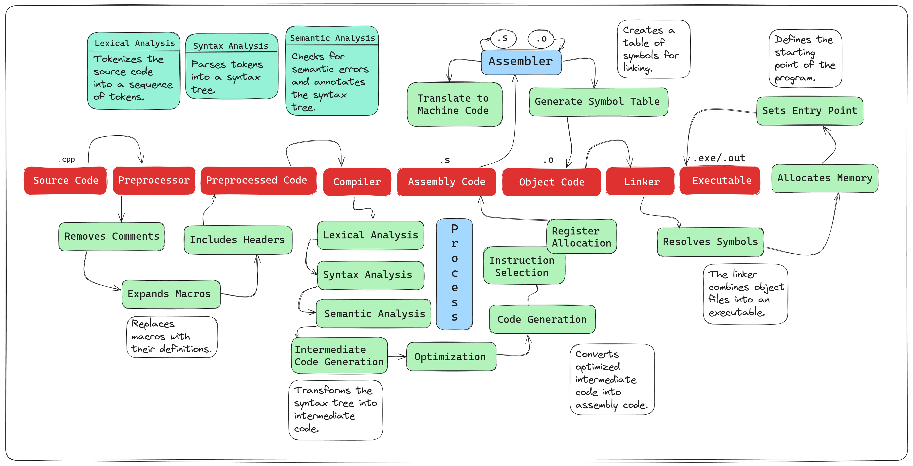

### Steps:
1. **Preprocessing**
2. **Compilation**
3. **Assembly**
4. **Linking**

### Diagram:


```mermaid
graph TD
    A[.cpp Source File] --> B[Preprocessor]
    B --> C[Preprocessed Source File]
    C --> D[Compiler]
    D --> E[Assembly Code]
    E --> F[Assembler]
    F --> G[Object Code (.o)]
    G --> H[Linker]
    H --> I[Executable File (.exe/.out)]
```

### Detailed Explanation:

1. **Preprocessing**:
   - **Input**: `.cpp` file (e.g., `main.cpp`)
   - **Process**: The preprocessor handles directives (e.g., `#include`, `#define`), macros, and removes comments.
   - **Output**: Preprocessed source file (typically still a `.cpp` file)

2. **Compilation**:
   - **Input**: Preprocessed source file
   - **Process**: The compiler translates the high-level C++ code into assembly code for the target architecture.
   - **Output**: Assembly code file (e.g., `main.s`)

3. **Assembly**:
   - **Input**: Assembly code file
   - **Process**: The assembler converts the assembly code into machine code, producing an object file.
   - **Output**: Object file (e.g., `main.o`)

4. **Linking**:
   - **Input**: Object file(s) and library files (if any)
   - **Process**: The linker combines multiple object files into a single executable. It resolves references between object files and includes library code.
   - **Output**: Executable file (e.g., `main.exe` on Windows, `main.out` on Unix/Linux)

### Additional Details:

- **Preprocessor**:
  - Removes comments
  - Expands macros
  - Includes header files
  - Conditional compilation

- **Compiler**:
  - Syntax analysis (parsing)
  - Semantic analysis
  - Optimization
  - Code generation

- **Assembler**:
  - Translates assembly instructions to machine code
  - Generates symbol table

- **Linker**:
  - Resolves external symbols
  - Allocates memory for code and data
  - Sets entry point for execution

Each of these steps is crucial in transforming human-readable C++ code into machine-executable code. This process involves multiple intermediate representations of the code, with each stage adding its own layer of processing and transformation.

### Diagram in Detail:

```mermaid
graph TD
    A[Source Code (.cpp)]
    A --> B[Preprocessor]
    B --> C[Preprocessed Code]
    C --> D[Compiler]
    D --> E[Assembly Code (.s)]
    E --> F[Assembler]
    F --> G[Object Code (.o)]
    G --> H[Linker]
    H --> I[Executable (.exe/.out)]

    B --> B1[Removes Comments]
    B --> B2[Expands Macros]
    B --> B3[Includes Headers]

    D --> D1[Parsing]
    D --> D2[Semantic Analysis]
    D --> D3[Optimization]
    D --> D4[Code Generation]

    F --> F1[Translates to Machine Code]
    F --> F2[Generates Symbol Table]

    H --> H1[Resolves Symbols]
    H --> H2[Allocates Memory]
    H --> H3[Sets Entry Point]
```

This detailed breakdown provides a clear view of the processes involved in compiling a `.cpp` file into an executable file at a machine level.